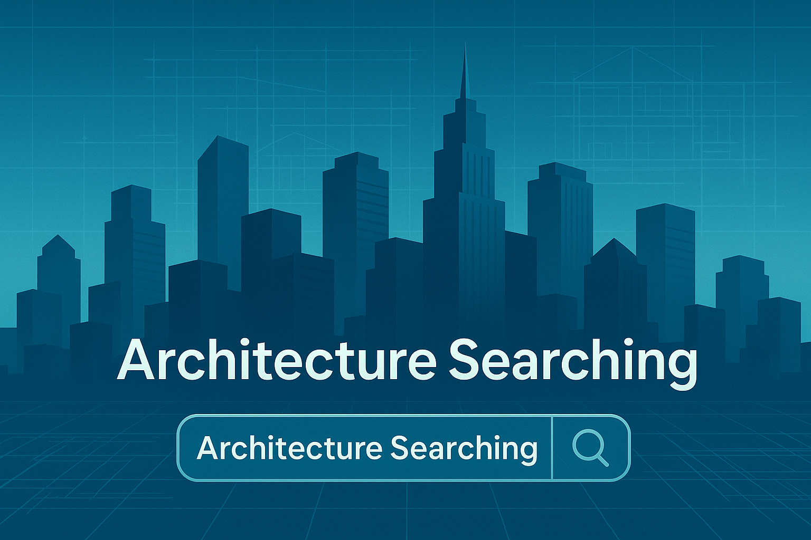

# Architecture Searching



**Architecture Searching**은 건축/건설 도메인을 중심으로, YouTube 영상과 뉴스 기사를 검색하고, AI를 통해 요약 및 종합 분석 보고서를 제공하는 서비스입니다.  
연구, 실무, 공모전, 트렌드 분석 등에 활용할 수 있도록 설계되었습니다.

---

## 🛠️ 주요 기능

1. 🎦 **YouTube 영상 검색 및 요약 보고서 생성**  
   - 자막/설명/댓글 정보를 기반으로 Gemini 모델이 영상 내용을 분석하여 요약합니다.

2. 📰 **뉴스 기사 검색 및 종합 분석 보고서 생성**  
   - 다수의 기사를 종합하여 주요 이슈, 다양한 시각, 시사점 등을 한 페이지 보고서로 정리합니다.

---

## 🚀 서비스 URL

(예: Streamlit Cloud 또는 로컬 서버 주소)  
```text
예: https://architecture-searching.streamlit.app/


## 기술 스택

개발언어: Python
웹 프레임워크: Streamlit
언어 모델 (LLM): Gemini 2.0 Flash (Google AI Studio)

사용 API:
- Google AI Studio API
- YouTube Data API v3
- Serp API (Google 뉴스 검색용)
- Apify API (YouTube 자막 보조 크롤링용)


